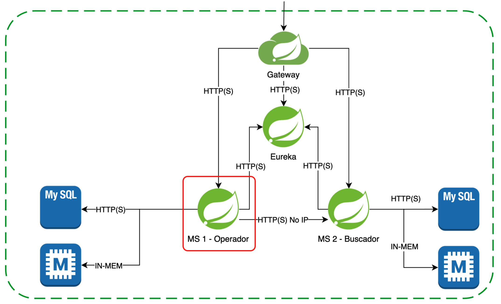

# E-Bass Store Orders API V1

Esta API permite gestionar los pedidos de una tienda de bajos eléctricos y accesorios, permitiendo consultar, crear,
modificar y eliminar pedidos. Tal como se muestra en el siguiente diagrama, este microservicio está pensado para ser
accesible a través de peticiones HTTP a un servidor perimetral Spring Cloud Gateway y un servicio de descubrimiento
Eureka. En este servicio de descubrimiento también está registrada la API para gestionar los productos, por lo que podrá
acceder ella simplemente conociendo el nombre del host con el que se haya registrado sin necesidad de conocer su IP y
puerto.

Los métodos que soporta son los siguientes sobre la URI principal `/api/v1/orders`:

- Obtener la lista completa de pedidos y el detalle de los productos incluidos mediante el método GET
- Obtener un pedido concreto y el detalle de los productos incluidos mediante el método GET, especificando en la URI su
  identificador `/{id}`
- Registrar un nuevo pedido en el catálogo mediante el método POST, indicando las referencias de los productos a incluir
  como una lista de `productRef` en el pedido en el cuerpo de la petición.
- Modificar el estado de un pedido existente mediante el método PATCH, especificando en la URI su identificador `/{id}`
  e indicando uno de los siguientes estados como query param `?status={status}`:
	* `Confirmed`: el pedido ha sido confirmado y se procederá a su preparación y envío.
	* `Shipped`: el pedido ha sido enviado al cliente.
	* `Delivered`: el pedido ha sido entregado al cliente.
	* `Cancelled`: el pedido ha sido cancelado.
- Eliminar un pedido existente mediante el método DELETE, especificando en la URI su identificador `/{id}`.

| Método HTTP | URI                         | Query Params | Cuerpo de la Petición          | Cuerpo de la Respuesta                                                                                                                                                                                                                                                                                                                                                                                                                   | Códigos de Respuesta                                                       |
|-------------|-----------------------------|--------------|--------------------------------|------------------------------------------------------------------------------------------------------------------------------------------------------------------------------------------------------------------------------------------------------------------------------------------------------------------------------------------------------------------------------------------------------------------------------------------|----------------------------------------------------------------------------|
| GET         | /api/v1/orders              | N/A          | N/A                            | `[{"id":1,"orderRef":"PO-20240126-1","date":"2024-01-26","total":1950.0,"products":[{"id":3,"productRef":"B03","category":"basses", ... },{"id":14,"productRef":"E04","category":"fx", ... }],"status":"Cancelled"},{"id":2,"orderRef":"PO-20240126-2","date":"2024-01-26","total":2800.0,"products":[{"id":2,"productRef":"B02","category":"basses", ... },{"id":6,"productRef":"A01","category":"amps", ... }],"status":"Confirmed"}]` | 200 OK 204 No Content 500 Internal Server Error                    |
| GET         | /api/v1/orders/{id}         | N/A          | N/A                            | `{"id": 1, "orderRef": "PO-20240126-1", "date": "2024-01-26", "total": 1950.0, "products": [{"id": 3, "productRef": "B03","category":"basses", ... }, {"id": 14, "productRef": "E04","category":"fx", ... }], status": "Cancelled"}`                                                                                                                                                                                                     | 200 OK 204 No Content 500 Internal Server Error                    |
| POST        | /api/v1/orders              | N/A          | `{"products": ["A03", "E01"]}` | `{"id":3,"orderRef":"PO-20240126-3","date":"2024-01-26","total":1020.0,"products":[{"id":8,"productRef":"A03","category":"amps", ... },{"id":11,"productRef":"E01","category":"fx", ... }],"status":"Confirmed"}}`                                                                                                                                                                                                                       | 200 OK 400 Bad Request 500 Internal Server Error                   |
| PATCH       | /api/v1/orders/{productRef} | status       | N/A                            | `{"id":3,"orderRef":"PO-20240126-3","date":"2024-01-26","total":1020.0,"products":[{"id":8,"productRef":"A03","category":"amps", ... },{"id":11,"productRef":"E01","category":"fx", ... }],"status":"Shipped"}`                                                                                                                                                                                                                          | 200 OK 400 Bad Request 404 Not Found 500 Internal Server Error |
| DELETE      | /api/v1/orders/{productRef} | N/A          | N/A                            | N/A                                                                                                                                                                                                                                                                                                                                                                                                                                      | 204 No Content 404 Not Found 500 Internal Server Error             |

Los métodos no soportados devolverán un código de estado 405 Method Not Allowed.